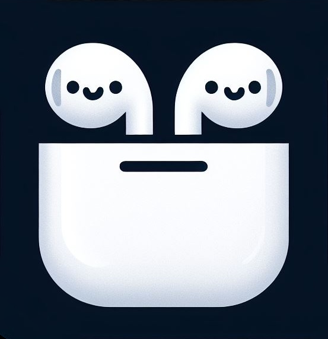

  <picture>
    
  </picture>
  <h1>PodPals</h1>

Control your music using airpods gestures.

## Features
- Works with Spotify and Apple Music desktop apps
- Menu bar app with customization for sensitivity and commands
- Easy (re)calibration
- Detects the following gestures: nod, left flick, and right flick
- Supports the following playback commands: play/pause, next track, and previous track
- More features coming soon!

## Installation

> Requirements: macOS 14.5 or later

1. Download the [`PodPals.zip`]() from the [Releases](https://github.com/pranavkarthik10/PodPals/releases/latest) page.
2. Unzip and drag the `PodPals.app` to your **Applications** folder.
3. Launch **PodPals** from your Applications folder or Spotlight.

## Usage
- Configure and start/stop tracking using the menu bar app
- Recalibrate when starting a new session for best results

## Credits
- Built using the CMHeadphoneMotionManager API in CoreMotion for tracking the gyroscopic movements of your AirPods.
- CoreMotion and Calibration components based off of https://github.com/DanielRudrich/Headitude
